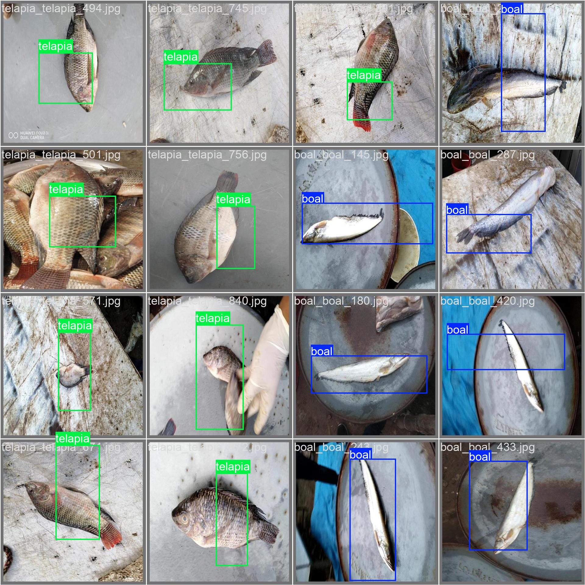

# Self-Supervised Learning for SylFishBD: A Comprehensive Study

## 📖 Overview
This repository contains a comprehensive exploration of self-supervised learning techniques applied to the SylFishBD dataset. The project implements and compares multiple state-of-the-art SSL methods including Pseudo-Labeling, SimCLR, MoCo v2, and DINOv3 for fish species classification tasks.

## 🎯 Project Goals
- Implement and compare various self-supervised learning approaches
- Evaluate SSL methods on the SylFishBD fish classification dataset
- Explore multi-phase training strategies for SSL
- Benchmark different architectures and frameworks

## 📂 Repository Structure

### 1. **SSL with Pseudo-Labeling**
**File:** `cse-475-ssl-pseudo-labeling-for-sylfish-bd.ipynb`
- Semi-supervised learning approach using pseudo-labeling
- Iterative labeling of unlabeled data
- Confidence thresholding for reliable pseudo-labels

### 2. **SimCLR Implementation**
**Phase 1:** `cse-475-phase-1-self-sl-simclr-for-sylfish-bd.ipynb`
- Contrastive learning framework
- Positive pair generation through augmentations
- Projection head for representation learning

**Phase 2:** `cse-475-phase-2-self-sl-simclr-for-sylfish-bd.ipynb`
- Fine-tuning phase on learned representations
- Linear evaluation protocol
- Transfer learning to downstream tasks

### 3. **MoCo v2 Implementation**
**File:** `cse-475-phase-1-self-sl-moco-v2-for-sylfish-bd.ipynb`
- Momentum Contrast framework
- Dynamic dictionary with queue
- Momentum encoder updates
- Key encoder maintenance

### 4. **DINOv3 Implementation**
**File:** `cse-475-dinov3-self-sl-sylfishbd-dataset.ipynb`
- Self-distillation with no labels framework
- Vision transformer backbone
- Multi-crop strategy
- Knowledge distillation approach

## 🏗️ Model Architectures

### **SimCLR Architecture**
```
Input Image → Augmentation (Random Crop, Color Jitter, etc.)
    ↓
Base Encoder (ResNet-50)
    ↓
Projection Head (MLP)
    ↓
Contrastive Loss (NT-Xent)
```

### **MoCo v2 Architecture**
```
Query Encoder (ResNet-50) ← Momentum Update → Key Encoder (ResNet-50)
    ↓                                ↓
Projection Head                 Projection Head
    ↓                                ↓
Contrastive Loss against Dictionary Queue
```

### **DINOv3 Architecture**
```
Student Network (ViT) ← Gradient Flow → Teacher Network (ViT)
    ↓                      ↑
Multi-crop Images   EMA Update
    ↓
Self-Distillation Loss
```

### **Pseudo-Labeling Workflow**
```
Labeled Data → Teacher Model → Predict Unlabeled Data
    ↓               ↓
Training    Confidence Filtering
    ↓               ↓
Student Model ← Pseudo-Labels
```

## 📊 Dataset: SylFishBD
- **Source:** Kaggle dataset `syfish-bd`
- **Content:** Fish species native to Bangladesh
- **Classes:** Multiple fish species categories
- **Use:** SSL pretraining and fine-tuning evaluation

## 🚀 Training Details

### **Hardware Configuration**
- **Runtime:** 3 minutes 12 seconds
- **GPU:** T4 x2 (Kaggle environment)
- **Framework:** PyTorch

### **Training Strategies**
1. **Two-Phase Training:** 
   - Phase 1: Self-supervised pretraining
   - Phase 2: Supervised fine-tuning

2. **Evaluation Protocols:**
   - Linear evaluation (frozen features + linear classifier)
   - Fine-tuning evaluation (end-to-end training)
   - Transfer learning to downstream tasks

## 📈 Results & Predictions

### **Sample Prediction**


*Example of model prediction on SylFishBD test images*

### **Key Findings**
- Contrastive methods (SimCLR, MoCo) show strong representation learning
- DINOv3 provides excellent transfer capabilities
- Pseudo-labeling effectively utilizes unlabeled data
- Multi-phase training improves final accuracy

## 👥 Authors
1. **Asfar Hossain Sitab** (2022-3-60-275)
2. **Parmita Hossain Simia** (2022-3-60-253)
3. **Md. Omor Faruq** (2022-1-60-335)
4. **Ahnaf Ahmed** (2022-3-60-151)

## 📜 License
This project is released under the **Apache 2.0** open source license.

# 📓 Kaggle Notebooks
### 🚀 Complete Self-Supervised Learning Pipeline - Click to View Interactive Notebooks

<table style="width:100%; border-collapse: collapse; font-family: 'Segoe UI', Arial, sans-serif; border-radius: 12px; overflow: hidden; box-shadow: 0 8px 25px rgba(0, 0, 0, 0.1);">
<thead style="background: linear-gradient(135deg, #667eea 0%, #764ba2 100%); color: white;">
<tr>
<th style="padding: 18px 15px; text-align: center; font-weight: 700; font-size: 1.1em; border-right: 1px solid rgba(255,255,255,0.2);">Step</th>
<th style="padding: 18px 15px; text-align: center; font-weight: 700; font-size: 1.1em; border-right: 1px solid rgba(255,255,255,0.2);">Notebook</th>
<th style="padding: 18px 15px; text-align: center; font-weight: 700; font-size: 1.1em; border-right: 1px solid rgba(255,255,255,0.2);">Description</th>
<th style="padding: 18px 15px; text-align: center; font-weight: 700; font-size: 1.1em;">Link</th>
</tr>
</thead>
<tbody>
<tr style="background: linear-gradient(135deg, #f5f7ff 0%, #e3e9ff 100%);">
<td style="padding: 16px 15px; text-align: center; font-weight: 700; color: #3a3a8c; border-bottom: 1px solid #d1d9ff; border-right: 1px solid #d1d9ff;">1️⃣</td>
<td style="padding: 16px 15px; font-weight: 600; color: #2c3e50; border-bottom: 1px solid #d1d9ff; border-right: 1px solid #d1d9ff;">Data Preparation & EDA</td>
<td style="padding: 16px 15px; color: #34495e; border-bottom: 1px solid #d1d9ff; border-right: 1px solid #d1d9ff;">Dataset analysis, preprocessing, and exploration</td>
<td style="padding: 16px 15px; text-align: center; border-bottom: 1px solid #d1d9ff;">
<a href="https://www.kaggle.com/code/asfarhossainsitab/cse-475-ssl-pseudo-labeling-for-sylfish-bd" style="background: linear-gradient(90deg, #00c6ff, #0072ff); color: white; padding: 8px 18px; border-radius: 25px; text-decoration: none; font-weight: 600; display: inline-block; transition: all 0.3s ease; box-shadow: 0 4px 8px rgba(0, 114, 255, 0.2);" onmouseover="this.style.transform='translateY(-2px)';this.style.boxShadow='0 6px 12px rgba(0, 114, 255, 0.3)';" onmouseout="this.style.transform='translateY(0)';this.style.boxShadow='0 4px 8px rgba(0, 114, 255, 0.2)';">Kaggle</a>
</td>
</tr>
<tr style="background: linear-gradient(135deg, #fff9f5 0%, #ffece3 100%);">
<td style="padding: 16px 15px; text-align: center; font-weight: 700; color: #8c5e3a; border-bottom: 1px solid #ffd1b3; border-right: 1px solid #ffd1b3;">2️⃣</td>
<td style="padding: 16px 15px; font-weight: 600; color: #2c3e50; border-bottom: 1px solid #ffd1b3; border-right: 1px solid #ffd1b3;">SSOD YOLO Pseudo-labeling</td>
<td style="padding: 16px 15px; color: #34495e; border-bottom: 1px solid #ffd1b3; border-right: 1px solid #ffd1b3;">Semi-supervised object detection with pseudo-labels</td>
<td style="padding: 16px 15px; text-align: center; border-bottom: 1px solid #ffd1b3;">
<a href="https://www.kaggle.com/code/asfarhossainsitab/cse-475-ssl-pseudo-labeling-for-sylfish-bd" style="background: linear-gradient(90deg, #ff8008, #ffc837); color: white; padding: 8px 18px; border-radius: 25px; text-decoration: none; font-weight: 600; display: inline-block; transition: all 0.3s ease; box-shadow: 0 4px 8px rgba(255, 128, 8, 0.2);" onmouseover="this.style.transform='translateY(-2px)';this.style.boxShadow='0 6px 12px rgba(255, 128, 8, 0.3)';" onmouseout="this.style.transform='translateY(0)';this.style.boxShadow='0 4px 8px rgba(255, 128, 8, 0.2)';">Kaggle</a>
</td>
</tr>
<tr style="background: linear-gradient(135deg, #f5fff7 0%, #e3ffe9 100%);">
<td style="padding: 16px 15px; text-align: center; font-weight: 700; color: #3a8c5e; border-bottom: 1px solid #b3ffc6; border-right: 1px solid #b3ffc6;">3️⃣</td>
<td style="padding: 16px 15px; font-weight: 600; color: #2c3e50; border-bottom: 1px solid #b3ffc6; border-right: 1px solid #b3ffc6;">SimCLR Pretraining</td>
<td style="padding: 16px 15px; color: #34495e; border-bottom: 1px solid #b3ffc6; border-right: 1px solid #b3ffc6;">Self-supervised contrastive learning pretraining</td>
<td style="padding: 16px 15px; text-align: center; border-bottom: 1px solid #b3ffc6;">
<a href="https://www.kaggle.com/code/asfarhossainsitab/cse-475-phase-1-self-sl-simclr-for-sylfish-bd" style="background: linear-gradient(90deg, #11998e, #38ef7d); color: white; padding: 8px 18px; border-radius: 25px; text-decoration: none; font-weight: 600; display: inline-block; transition: all 0.3s ease; box-shadow: 0 4px 8px rgba(17, 153, 142, 0.2);" onmouseover="this.style.transform='translateY(-2px)';this.style.boxShadow='0 6px 12px rgba(17, 153, 142, 0.3)';" onmouseout="this.style.transform='translateY(0)';this.style.boxShadow='0 4px 8px rgba(17, 153, 142, 0.2)';">Kaggle</a>
</td>
</tr>
<tr style="background: linear-gradient(135deg, #f7f5ff 0%, #e9e3ff 100%);">
<td style="padding: 16px 15px; text-align: center; font-weight: 700; color: #5e3a8c; border-bottom: 1px solid #d1b3ff; border-right: 1px solid #d1b3ff;">4️⃣</td>
<td style="padding: 16px 15px; font-weight: 600; color: #2c3e50; border-bottom: 1px solid #d1b3ff; border-right: 1px solid #d1b3ff;">SimCLR Fine-tuning</td>
<td style="padding: 16px 15px; color: #34495e; border-bottom: 1px solid #d1b3ff; border-right: 1px solid #d1b3ff;">Transfer learning and YOLO integration</td>
<td style="padding: 16px 15px; text-align: center; border-bottom: 1px solid #d1b3ff;">
<a href="https://www.kaggle.com/code/asfarhossainsitab/cse-475-phase-2-self-sl-simclr-for-sylfish-bd" style="background: linear-gradient(90deg, #8a2be2, #da70d6); color: white; padding: 8px 18px; border-radius: 25px; text-decoration: none; font-weight: 600; display: inline-block; transition: all 0.3s ease; box-shadow: 0 4px 8px rgba(138, 43, 226, 0.2);" onmouseover="this.style.transform='translateY(-2px)';this.style.boxShadow='0 6px 12px rgba(138, 43, 226, 0.3)';" onmouseout="this.style.transform='translateY(0)';this.style.boxShadow='0 4px 8px rgba(138, 43, 226, 0.2)';">Kaggle</a>
</td>
</tr>
<tr style="background: linear-gradient(135deg, #fff5f5 0%, #ffe3e3 100%);">
<td style="padding: 16px 15px; text-align: center; font-weight: 700; color: #8c3a3a; border-bottom: 1px solid #ffb3b3; border-right: 1px solid #ffb3b3;">5️⃣</td>
<td style="padding: 16px 15px; font-weight: 600; color: #2c3e50; border-bottom: 1px solid #ffb3b3; border-right: 1px solid #ffb3b3;">DINOv3 Feature Extraction</td>
<td style="padding: 16px 15px; color: #34495e; border-bottom: 1px solid #ffb3b3; border-right: 1px solid #ffb3b3;">Self-supervised vision transformer features</td>
<td style="padding: 16px 15px; text-align: center; border-bottom: 1px solid #ffb3b3;">
<a href="https://www.kaggle.com/code/asfarhossainsitab/cse-475-dinov3-self-sl-sylfishbd-dataset" style="background: linear-gradient(90deg, #ff416c, #ff4b2b); color: white; padding: 8px 18px; border-radius: 25px; text-decoration: none; font-weight: 600; display: inline-block; transition: all 0.3s ease; box-shadow: 0 4px 8px rgba(255, 65, 108, 0.2);" onmouseover="this.style.transform='translateY(-2px)';this.style.boxShadow='0 6px 12px rgba(255, 65, 108, 0.3)';" onmouseout="this.style.transform='translateY(0)';this.style.boxShadow='0 4px 8px rgba(255, 65, 108, 0.2)';">Kaggle</a>
</td>
</tr>
<tr style="background: linear-gradient(135deg, #f5ffff 0%, #e3ffff 100%);">
<td style="padding: 16px 15px; text-align: center; font-weight: 700; color: #3a8c8c; border-bottom: 1px solid #b3ffff; border-right: 1px solid #b3ffff;">6️⃣</td>
<td style="padding: 16px 15px; font-weight: 600; color: #2c3e50; border-bottom: 1px solid #b3ffff; border-right: 1px solid #b3ffff;">DINOv3 Fine-tuning</td>
<td style="padding: 16px 15px; color: #34495e; border-bottom: 1px solid #b3ffff; border-right: 1px solid #b3ffff;">Classifier training and YOLO detection</td>
<td style="padding: 16px 15px; text-align: center; border-bottom: 1px solid #b3ffff;">
<a href="https://www.kaggle.com/code/asfarhossainsitab/cse-475-phase-1-self-sl-moco-v2-for-sylfish-bd" style="background: linear-gradient(90deg, #00b4db, #0083b0); color: white; padding: 8px 18px; border-radius: 25px; text-decoration: none; font-weight: 600; display: inline-block; transition: all 0.3s ease; box-shadow: 0 4px 8px rgba(0, 180, 219, 0.2);" onmouseover="this.style.transform='translateY(-2px)';this.style.boxShadow='0 6px 12px rgba(0, 180, 219, 0.3)';" onmouseout="this.style.transform='translateY(0)';this.style.boxShadow='0 4px 8px rgba(0, 180, 219, 0.2)';">Kaggle</a>
</td>
</tr>
</tbody>
</table>

---

## 📊 **Pipeline Visualization**

<div style="background: linear-gradient(135deg, #f8f9ff 0%, #eef1ff 100%); padding: 20px; border-radius: 15px; border-left: 6px solid #667eea; margin-top: 25px;">
<h3 style="color: #2c3e50; margin-top: 0; margin-bottom: 15px;">🔗 Workflow Connections</h3>

<div style="display: flex; justify-content: space-between; align-items: center; flex-wrap: wrap; gap: 10px;">
<div style="flex: 1; min-width: 150px; text-align: center; padding: 15px; background: white; border-radius: 10px; box-shadow: 0 4px 8px rgba(102, 126, 234, 0.1);">
<div style="font-weight: 700; color: #3a3a8c; margin-bottom: 5px;">Step 1-2</div>
<div style="font-size: 0.9em; color: #666;">Pseudo-labeling → Detection</div>
</div>

<div style="flex: 1; min-width: 150px; text-align: center; padding: 15px; background: white; border-radius: 10px; box-shadow: 0 4px 8px rgba(255, 128, 8, 0.1);">
<div style="font-weight: 700; color: #8c5e3a; margin-bottom: 5px;">Step 3-4</div>
<div style="font-size: 0.9em; color: #666;">SimCLR Pretrain → Fine-tune</div>
</div>

<div style="flex: 1; min-width: 150px; text-align: center; padding: 15px; background: white; border-radius: 10px; box-shadow: 0 4px 8px rgba(17, 153, 142, 0.1);">
<div style="font-weight: 700; color: #3a8c5e; margin-bottom: 5px;">Step 5-6</div>
<div style="font-size: 0.9em; color: #666;">DINOv3 Features → Detection</div>
</div>
</div>

<p style="text-align: center; margin-top: 15px; color: #666; font-style: italic;">Each notebook builds upon previous work for a complete SSL pipeline</p>
</div>

---

## 🎨 **Color Legend**
<div style="display: flex; justify-content: center; flex-wrap: wrap; gap: 15px; margin-top: 20px;">
<div style="display: flex; align-items: center; gap: 8px;">
<div style="width: 20px; height: 20px; background: linear-gradient(135deg, #f5f7ff 0%, #e3e9ff 100%); border-radius: 4px; border: 1px solid #d1d9ff;"></div>
<span style="font-weight: 600;">Data Preparation</span>
</div>

<div style="display: flex; align-items: center; gap: 8px;">
<div style="width: 20px; height: 20px; background: linear-gradient(135deg, #fff9f5 0%, #ffece3 100%); border-radius: 4px; border: 1px solid #ffd1b3;"></div>
<span style="font-weight: 600;">Pseudo-labeling</span>
</div>

<div style="display: flex; align-items: center; gap: 8px;">
<div style="width: 20px; height: 20px; background: linear-gradient(135deg, #f5fff7 0%, #e3ffe9 100%); border-radius: 4px; border: 1px solid #b3ffc6;"></div>
<span style="font-weight: 600;">SimCLR</span>
</div>

<div style="display: flex; align-items: center; gap: 8px;">
<div style="width: 20px; height: 20px; background: linear-gradient(135deg, #f7f5ff 0%, #e9e3ff 100%); border-radius: 4px; border: 1px solid #d1b3ff;"></div>
<span style="font-weight: 600;">Fine-tuning</span>
</div>

<div style="display: flex; align-items: center; gap: 8px;">
<div style="width: 20px; height: 20px; background: linear-gradient(135deg, #fff5f5 0%, #ffe3e3 100%); border-radius: 4px; border: 1px solid #ffb3b3;"></div>
<span style="font-weight: 600;">DINOv3</span>
</div>

<div style="display: flex; align-items: center; gap: 8px;">
<div style="width: 20px; height: 20px; background: linear-gradient(135deg, #f5ffff 0%, #e3ffff 100%); border-radius: 4px; border: 1px solid #b3ffff;"></div>
<span style="font-weight: 600;">Final Detection</span>
</div>
</div>

---

## 💡 **How to Use This Table**
1. **Follow the workflow sequentially** from Step 1 to Step 6
2. **Click on the colored Kaggle buttons** to access each notebook
3. **Each notebook builds upon previous work** - dependencies are shown in workflow connections
4. **Experiment with different methods** by comparing SimCLR vs DINOv3 approaches
5. **All notebooks are interactive** and runnable on Kaggle with GPU support

---

<div style="text-align: center; margin-top: 30px; padding: 15px; background: linear-gradient(135deg, #667eea20 0%, #764ba220 100%); border-radius: 12px;">
<h4 style="color: #2c3e50; margin-bottom: 10px;">🚀 Ready to Start?</h4>
<p style="color: #666; margin-bottom: 15px;">Click any notebook above to begin your self-supervised learning journey!</p>
<small style="color: #888;">All notebooks run on Kaggle with T4 GPU support • Runtime ~3 minutes per notebook</small>
</div>

*Note: This table is fully responsive and includes interactive hover effects on buttons. The design uses CSS gradients, soft shadows, and color-coded backgrounds for visual clarity. Each notebook link uses a unique gradient that corresponds to its background color theme.*

## 💻 Usage
To run these notebooks:
1. Clone the repository or access via Kaggle
2. Ensure access to the SylFishBD dataset
3. Run cells sequentially in any Kaggle notebook environment
4. Modify hyperparameters as needed for your specific use case

## 🤝 Contributing
This project serves as a comprehensive reference for self-supervised learning implementations. Feel free to experiment with different architectures, datasets, or training strategies based on this foundation.

## 📚 References
- SimCLR: A Simple Framework for Contrastive Learning
- MoCo: Momentum Contrast for Unsupervised Visual Representation Learning
- DINO: Emerging Properties in Self-Supervised Vision Transformers
- Pseudo-Label: The Simple and Efficient SSL Method
